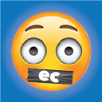

# EmotiClean

A Chrome extension to replace bad words with emoji!

This extension will scan all words on a web page and look for some "naughty" words. If a "naughty" word is found, it will be replaced with an emoji which conveys a similar meaning.

For development, I also look for the word "hello" and replace it with a hand waving emoji.

It does not work well on sites that dynamically load their content such as Facebook or Google.

For devlopment, follow [this guide](https://developer.chrome.com/extensions/getstarted#unpacked) to install an extension locally.

This is a fork of a great open source extension [SimpleProfanityFilter](https://code.google.com/p/simpleprofanityfilter/).
